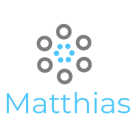

<!-- PROJECT LOGO -->
 

  

  <h3 align="center">Food Delivery App UI </h3>

  

A React Native App UI    
    <a href="https://github.com/RemonMatthias/Next-Static-Website"><strong>Explore the docs »</strong></a>
     
     
    <a href="https://next-static-website-d7a1d.web.app/">View Demo</a>

  

<!-- TABLE OF CONTENTS -->

  
Table of Contents

  <ol>
    <li>
      <a href="#about-the-project">About The Project</a>
      <ul>
        <li><a href="#built-with">Built With</a></li>
      </ul>
    </li>
    <li><a href="#author">Author</a></li>
  </ol>

<!-- ABOUT THE PROJECT -->

## About The Project

    

This App UI is a result of a pixel perfect execution of a design made using figma . It shows the precision and attention to details while developing the UI using React-Native.

### Built With

Next has been built using modern technologies such as :

- [React Js](https://reactjs.org/)
- [React-Native](https://reactnative.dev/)
- [Expo](https://expo.io/)
- [React-Navigation](https://reactnavigation.org/)

## Author

**Remon Matthias**

- [Profile](https://github.com/RemonMatthias)
- [Email](remonmatthias.business@gmail.com)
- [Website]("Welcome")
